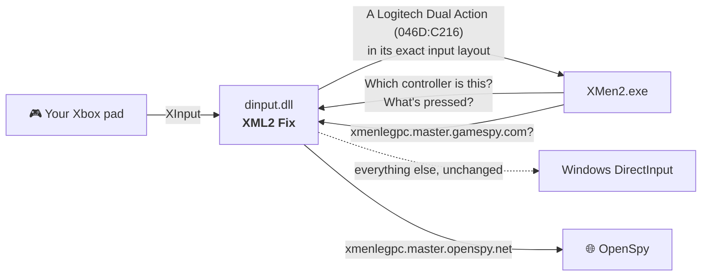

<p align="center">
  
</p>

<p align="center">
  <a href="https://github.com/ChronoRixun/xml2-fix/releases/latest"></a>
  <a href="https://github.com/ChronoRixun/xml2-fix/actions/workflows/build.yml"></a>
  
  <a href="LICENSE"></a>
</p>

<p align="center">
  <b>Drop in one file. Pick up your pad and play, alone or on the couch.</b>
</p>

---

**X-Men Legends II: Rise of Apocalypse** on PC detects your controller and then leaves it completely unbound. The PC version only ships keyboard defaults, so the game sends you to *Advanced options* to assign all 42 actions by hand, for every player. And its online mode has been dead since GameSpy shut down in 2014.

**XML2 Fix** takes care of the controls, and is working on online play:

|                       | Without the fix | With the fix |
| --------------------- | --------------- | ------------ |
| First start with a pad | "go to Advanced options", nothing bound | console-style layout, ready to play |
| Local co-op           | bind every pad yourself | players 2–4 get pads 2–4 automatically |
| Modern Xbox pads (e.g. over Bluetooth) | odd axes and trigger behaviour | one consistent layout for every pad |
| Online                | GameSpy servers gone | redirected to [OpenSpy](https://openspy.net) (lobby: [in progress](#-online)) |
| Setup                 | — | copy one file |

## ⚡ Install

1. **[Download the latest release](https://github.com/ChronoRixun/xml2-fix/releases/latest)** and unzip it.
2. Copy **`dinput.dll`** into the game folder, the one that contains **`XMen2.exe`**.
3. Start the game. Your controller is already bound.

**Uninstall:** delete `dinput.dll` from the game folder. Your bindings stay as they are and can be changed or reset in the game's *Options → Controls → Advanced*.

## 🎮 The layout

Raven's console layout, taken from the game's own console button map and put in the same positions on an Xbox pad:

| Pad | Action | | Pad | Action |
| --- | ------ | - | --- | ------ |
| Left stick | Move | | Right stick | Camera |
| **A** | Attack / Power 1 | | **B** | Smash / Power 2 |
| **Y** | Jump / Xtreme | | **X** | Use / Boost |
| **RT** (hold) | Use Powers | | **RB** | Energy Pack |
| **LT** | Call Allies | | **LB** | Health Pack |
| D-pad | Choose hero | | Right stick click | Map |
| **Start** | Pause | | **Back** | Stats |

Hold **RT** with a face button for powers, as on console. In menus, **A** accepts and **B** goes back.

- **Player 1** gets pad 1 *alongside* the keyboard (the pad is the secondary binding), so keyboard play keeps working.
- **Players 2–4** get pads 2–4.
- The fix only fills in bindings that are empty or still on the game's defaults (or on a layout an earlier version of the fix wrote). Anything you've customised is left alone, and you can rebind freely afterwards.

**Controllers:** tested with an Xbox Wireless Controller (Series X|S) over Bluetooth. Other Xbox One / Series and Xbox 360 pads, and third-party XInput pads, use the same path and are expected to work. PlayStation and Switch pads work through a tool that presents them as an Xbox pad (Steam Input, DS4Windows); untested. Tried one? Please [open an issue](https://github.com/ChronoRixun/xml2-fix/issues) and say how it went.

## 🌐 Online

> **Work in progress.** The redirect below works, but XML2's online lobby isn't usable on OpenSpy yet: the game lists games by region, and OpenSpy has no regions set up for it, so the region list comes up empty. We're working on it.

The game finds servers and other players through GameSpy, which no longer exists. [OpenSpy](https://openspy.net) runs community replacements for GameSpy's services, and the fix points the game's lookups there (`xmenlegpc.master.gamespy.com` → `xmenlegpc.master.openspy.net`, and so on).

To use another server (for example one you host yourself) or to switch the redirect off, create `xml2-fix.ini` next to the DLL:

```ini
[Online]
Domain=openspy.net   ; or your server's domain, or: off
```

**Diagnosing online problems:** add this to `xml2-fix.ini` and `xml2-fix.log` will list every connection and query the game makes:

```ini
[Debug]
LogNetwork=1
```

## 🔍 What was actually wrong

- **No gamepad defaults.** The PC build's built-in bindings table has keyboard keys for player 1 and nothing at all for gamepads, for any player. Even a controller the game knows by name starts unbound.
- **Modern pads look odd to it.** The game reads pads through DirectInput. An Xbox Wireless Controller over Bluetooth, for example, reports both triggers on one shared axis and a different axis set to what 2005-era pads had, so even hand-made bindings behave oddly.
- **GameSpy is gone,** and with it the servers the game looks up by name.

## 🛠️ How the fix works

`dinput.dll` sits in the game folder, where Windows loads it in place of its own copy. It forwards everything to the real DirectInput and:

1. **Presents every Xbox-compatible pad as a Logitech Dual Action** (`046D:C216`), a classic pad from the game's era with digital triggers and the right stick on Z / Rz. It builds that pad's DirectInput state from XInput, in the Dual Action's exact layout (buttons, hat, both sticks, respecting the game's own axis ranges). The game reads pads through two separate DirectInput versions, and both see the same pad.
2. **Adds the layout above to the game's bindings.** It patches it into the game's built-in defaults in memory, so first runs and *Revert to defaults* include it, and adds it once to settings you already have.
3. **Redirects GameSpy host lookups to OpenSpy.**



It doesn't touch the game's files or saves, and it doesn't need an installer.

## 🧰 Troubleshooting

- **Nothing changed?** Make sure `dinput.dll` is in the same folder as `XMen2.exe`, not a subfolder.
- **Bindings still empty?** The fix only adds its layout to players with no gamepad bindings at all. If you had already bound a pad for a player, that player keeps your setup. Use *Revert to defaults* in *Advanced options* to get the fix's layout.
- **Every launch writes `xml2-fix.log`** next to the DLL. It lists what the game saw and what the fix did. Attach it to any bug report.
- **Using Steam Input** (for a non-Steam shortcut) and buttons are off? Turn it off for the game, so the game sees your pad directly.

## 🏗️ Building from source

Requires Visual Studio 2022 with the C++ workload (which includes CMake).

```powershell
cmake -S . -B build -A Win32
cmake --build build --config Release
build\bin\Release\xml2_test.exe          # add --live to watch your pad as the game sees it
```

The output is `build\bin\Release\dinput.dll`. `xml2_test.exe` loads it the way the game does, then reads a connected controller through both of the game's DirectInput paths and checks the OpenSpy redirect. Release builds are produced by [GitHub Actions](.github/workflows/build.yml) from tagged source.

Also by the same author: [MUA Controller Fix](https://github.com/ChronoRixun/mua-controller-fix), for Marvel: Ultimate Alliance 1 & 2 (2016 PC).

## 📜 License & disclaimer

[MIT](LICENSE). Use it, share it, build on it.

This is an unofficial fan fix. It is not affiliated with or endorsed by Activision, Marvel, Disney, Microsoft, Logitech or OpenSpy. It contains no game files or game code; you need your own copy of the game.
