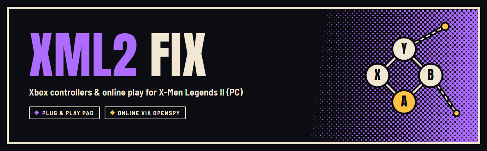
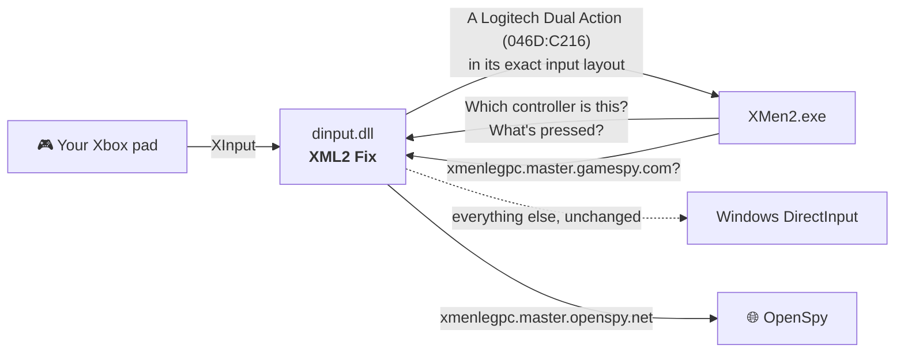

<p align="center">
  
</p>

<p align="center">
  <a href="https://github.com/ChronoRixun/xml2-fix/releases/latest"></a>
  <a href="https://github.com/ChronoRixun/xml2-fix/actions/workflows/build.yml"></a>
  
  <a href="LICENSE"></a>
</p>

<p align="center">
  <b>Drop in one file. Pick up your pad and play, alone or on the couch.</b>
</p>

---

**X-Men Legends II: Rise of Apocalypse** on PC detects your controller and then leaves it completely unbound. The PC version only ships keyboard defaults, so the game sends you to *Advanced options* to assign all 42 actions by hand, for every player. And its online mode has been dead since GameSpy shut down in 2014.

**XML2 Fix** takes care of the controls, and is working on online play:

|                       | Without the fix | With the fix |
| --------------------- | --------------- | ------------ |
| First start with a pad | "go to Advanced options", nothing bound | console-style layout, ready to play |
| Local co-op           | bind every pad yourself | players 2–4 get pads 2–4 automatically |
| Modern Xbox pads (e.g. over Bluetooth) | odd axes and trigger behaviour | one consistent layout for every pad |
| Online                | GameSpy servers gone | redirected to [OpenSpy](https://openspy.net) (lobby: [in progress](#-online)) |
| Display               | exclusive fullscreen only, switches your monitor's mode, no native resolution in the list, 60 fps | borderless or windowed at your desktop's resolution, frame rate and vsync of your choosing, [set in the game's own options](#%EF%B8%8F-display) |
| Discord               | — | shows what you're playing on your profile: the zone, your heroes, online co-op ([details](#-discord), easy to switch off) |
| Setup                 | — | copy one file |

## ⚡ Install

1. **[Download the latest release](https://github.com/ChronoRixun/xml2-fix/releases/latest)** and unzip it.
2. Copy **`dinput.dll`** into the game folder, the one that contains **`XMen2.exe`**.
3. Start the game. Your controller is already bound.

**Uninstall:** delete `dinput.dll` from the game folder. Your bindings stay as they are and can be changed or reset in the game's *Options → Controls → Advanced*.

## 🎮 The layout

Raven's console layout, taken from the game's own console button map and put in the same positions on an Xbox pad:

| Pad | Action | | Pad | Action |
| --- | ------ | - | --- | ------ |
| Left stick | Move | | Right stick | Camera |
| **A** | Attack / Power 1 | | **B** | Smash / Power 2 |
| **Y** | Jump / Xtreme | | **X** | Use / Boost |
| **RT** (hold) | Use Powers | | **RB** | Energy Pack |
| **LT** | Call Allies | | **LB** | Health Pack |
| D-pad | Choose hero | | Right stick click | Map |
| **Start** | Pause | | **Back** | Stats |

Hold **RT** with a face button for powers, as on console. In menus, **A** accepts and **B** goes back.

- **Player 1** gets pad 1 *alongside* the keyboard (the pad is the secondary binding), so keyboard play keeps working.
- **Players 2–4** get pads 2–4.
- The fix only fills in bindings that are empty or still on the game's defaults (or on a layout an earlier version of the fix wrote). Anything you've customised is left alone, and you can rebind freely afterwards.

### Button prompts

The PC version names every prompt after the keyboard, pad or not: *[E] Talk to Jean*, *[P] Assign*, the tutorial hints, the skills screen's power wheel. With the fix, a player on a pad sees the pad's buttons, as on console: **A**, **B**, **X** and **Y** as the letter in its Xbox colour, the rest as *[LB]*, *[Start]*, *[D-pad Up]*. Each player's prompts follow the device they last pressed something on, so switching between keyboard and pad switches them too.

The power wheel also shows the buttons that fire its powers in play: the stock game labels it with the team menu's own keys (*[Esc]* on the right, the menus' back key), not the ones you hold *Power* with in a fight.

```ini
[Input]
Prompts=auto       ; auto (the default): the device each player last used; pad; keyboard; off: the game's own prompts
PromptColors=1     ; 0: every pad button as [A]-style text
```

**Controllers:** tested with an Xbox Wireless Controller (Series X|S) over Bluetooth. Other Xbox One / Series and Xbox 360 pads, and third-party XInput pads, use the same path and are expected to work. PlayStation and Switch pads work through a tool that presents them as an Xbox pad (Steam Input, DS4Windows); untested. Tried one? Please [open an issue](https://github.com/ChronoRixun/xml2-fix/issues) and say how it went.

## 🌐 Online

> **Work in progress.** The redirect below works, but XML2's online lobby isn't usable on OpenSpy yet: the game lists games by region, and OpenSpy has no regions set up for it, so the region list comes up empty. Details and next steps: [docs/online-status.md](docs/online-status.md).

The game finds servers and other players through GameSpy, which no longer exists. [OpenSpy](https://openspy.net) runs community replacements for GameSpy's services, and the fix points the game's lookups there (`xmenlegpc.master.gamespy.com` → `xmenlegpc.master.openspy.net`, and so on).

To use another server (for example one you host yourself) or to switch the redirect off, create `xml2-fix.ini` next to the DLL:

```ini
[Online]
Domain=openspy.net   ; or your server's domain, or: off
```

**A server of your own without DNS names** (a self-hosted OpenSpy, for example [its Docker setup](https://github.com/openspy/compose) on your own PC or LAN): give its IPv4 address instead, and every GameSpy (and OpenSpy) host name the game looks up resolves to it.

```ini
[Online]
Server=127.0.0.1     ; every *.gamespy.com / *.openspy.net lookup -> this address; wins over Domain
```

The game looks up `xmenlegpc.available` and `xmenlegpc.master` (UDP 27900: the availability check and a hosted game's heartbeats), `xmenlegpc.ms<N>` (TCP 28910: the game and region lists) and `natneg1`/`natneg2` (UDP 27901), all under `gamespy.com`, so that server needs those ports. `xml2-fix.log` lists each name the first time it is sent there (`online: xmenlegpc.master.gamespy.com -> 127.0.0.1 ([Online] Server)`). A value that isn't an IPv4 address is ignored, with a line in the log, and `Domain` applies.

**The game's own address (LocalIP).** The Play Online screen shows a *LocalIP*: the address the game binds its game socket to (UDP 5165) and lists first in a hosted game's heartbeats. The game takes the first address Windows gives for the PC's own name, and Windows lists them in adapter order, not by route - so on a PC with WSL, Hyper-V, Docker or a VPN, it is often a virtual adapter's (`172.18.x.x`, say) that can't reach the internet, and hosting online fails. The fix puts the address Windows reaches the internet from (the default route's) first instead; the others follow in Windows' order, so LAN players still see them all.

```ini
[Online]
LocalIP=auto         ; the default. Or: first (Windows' order, as without the fix), or one of this PC's addresses, e.g. 192.168.1.20
```

An address that isn't this PC's is ignored and `auto` applies. Without a route to the internet, Windows' order stays. `xml2-fix.log` shows the list once, before and after (`online: this PC's addresses (MYPC): 172.18.0.1, 192.168.1.20` then `online: LocalIP: 192.168.1.20 first (...): 192.168.1.20, 172.18.0.1`).

**Diagnosing online problems:** add this to `xml2-fix.ini` and `xml2-fix.log` will list every connection and query the game makes:

```ini
[Debug]
LogNetwork=1
```

## 🖥️ Display

Out of the box the game runs in exclusive fullscreen, switches your monitor to the resolution in its settings (1920x1080, say, on a 2560x1440 screen), doesn't offer your screen's own resolution in *Options → Video* and caps itself at 60 fps.

**In the game:** *Options → Controls → Advanced* gets four rows under *FSAA*: **Display mode** (Fullscreen / Borderless / Windowed), **Frame rate** (30 to 240, your desktop's refresh rate, Refresh, Unlimited), **VSync** (Off / On) and **Run in background** (Off / On). Left/right, Enter or a click cycle a value; *Accept* keeps it, *Back* or Esc asks before discarding, *Revert to default* puts the rows back to the stock values. A row set to its stock value (Fullscreen, 60, VSync Off, Run in background On) removes its key from `xml2-fix.ini` on *Accept*, so the game is back to its own behaviour (its own fullscreen, its own 60 fps cap) rather than the fix's version of that value. Frame rate, Run in background and, in a window, VSync take effect at once; the display mode (and VSync in fullscreen) after a restart, and the panel says so. Nothing changes until you change a row: with the rows untouched and no `[Display]` keys the game runs exactly as before, rows aside (its Video options list included - see *Resolutions*).

The rows read and write `xml2-fix.ini` next to the DLL, the same keys you can set by hand (a launcher can edit them too):

```ini
[Display]
Mode=borderless      ; fullscreen, borderless or windowed; leave out for the game's own behaviour
Width=0              ; force a resolution; 0 = your desktop's size (borderless) or the game's own setting
Height=0
Topmost=0            ; borderless/windowed: 1 keeps the game above other windows
RunInBackground=1    ; borderless/windowed: 0 pauses the game when another window has the focus, like the stock game
FrameRate=refresh    ; a number of fps, refresh (your desktop's rate) or 0 (unlimited); leave out for the game's own 60 fps cap
VSync=0              ; 1 or 0; leave out for the engine's own setting
InGameOptions=1      ; 0 hides the rows in Advanced Options
ResolutionList=all   ; all: up to 64 entries in Options → Video, in every mode; game: the game's own 20; leave out for the game's own list
```

- **borderless**: a window without borders covering the screen, at your desktop's resolution and refresh rate. Your monitor's mode never changes, alt-tab is instant and the game keeps running behind other windows.
- **windowed**: a normal, centred window with a caption, the size of the resolution the game is set to (or `Width` x `Height`).
- **fullscreen**: the game's own exclusive fullscreen, but the desktop resolution is offered in *Options → Video*, and at that resolution the desktop's refresh rate is kept.

**Resolutions.** The game keeps its Video options list in a table with room for 20 entries and no bounds check: a modern adapter offers more sizes than that (24 on the development PC), and the ones past the 20th are written over the default key bindings that follow the table. With a `Mode` set the fix builds the list itself (your adapter's sizes plus your desktop's) and trims it to those 20. `ResolutionList=all` gives the game a table of its own with 64 entries instead (after checking the game's code is the retail build's; on any other build the list is trimmed to 20, so it can't overflow), and fills the list in every mode, the game's own included: every size your adapter offers, your desktop's resolution and, in the borderless and windowed modes, the common sizes of your desktop's aspect ratio plus half and three quarters of it as render-scale presets (1280x720 and 1920x1080 on a 2560x1440 desktop, stretched to the screen in borderless mode). `ResolutionList=game` keeps the game's 20-entry table but trims the list to it in every mode (the overflow fix alone). Without `ResolutionList` and without a `Mode`, the list is the game's own, overflow and all, as it ships. `Width`/`Height` from the ini shows as the selected entry. A resolution still applies at the next start, with the game's own restart notice.

In borderless mode with `Width`/`Height` at 0 the game starts at the desktop size every time; a resolution picked in the menu applies for that session (it is stretched to the screen). Everything the fix decides about the window, the Direct3D device and the list is written to `xml2-fix.log`.

**Frame rate.** The game caps itself at 60 fps by spinning on a core at the end of every frame, whatever your monitor does. `FrameRate` switches that spin off and paces frames with a high-resolution timer instead: `FrameRate=144` for 144 fps, `FrameRate=refresh` for your desktop's refresh rate, `FrameRate=0` for no cap at all. The game's simulation runs on wall-clock time, so a higher frame rate doesn't change its speed. Menus, popups and conversations stay at 60 fps (or at `FrameRate` when that is lower): their animations and key repeat run on time as well, but they take a button press from one frame to the next with no debounce, so at 180 fps a d-pad's bounce or a stick resting near its threshold registers as a second press and the highlight skips items. The fix reads the same state the game's own "is a menu up" test reads and goes back to your `FrameRate` as soon as you are playing; movies and loading screens keep it too. `FrameRate` and `VSync` work in every mode, the game's own included; without them nothing about the frame timing changes.

**VSync.** In `fullscreen` (and the game's own mode) `VSync=1` waits for the vertical blank and `VSync=0` never does (the engine's own default). In `borderless` and `windowed` Direct3D 8 has no usable vsync (the only one it offers runs at about 32 fps on a modern desktop), so there `VSync=1` means frames are paced at your desktop's refresh rate, never above `FrameRate`, and the desktop compositor shows them without tearing; with `FrameRate` left out the game's own 60 fps cap stays in charge.

## 💬 Discord

With the Discord app running on the same PC, your Discord profile shows what you're doing in the game while it runs, with the game's logo and a badge for the mode, as it does for newer games:

> **X-Men Legends II**<br>
> Act 1 · Sanctuary<br>
> Wolverine, Storm +2 · Lv 10-12<br>
> 00:42 elapsed

The X-Men Legends I port shows as **X-Men Legends**, XML2 as **X-Men Legends II**. The fix tells them apart by the port's `Scripts\x1` folder (in the game folder, or in a mod that loads: one `mods\load-order.txt` switches off doesn't count) or its `[Game] PostgameScript=x1/...` or `SaveFolder=X-Men Legends`.

| In the game | Discord shows | Badge on the logo |
| ----------- | ------------- | ----------------- |
| The main menu, and before the first zone | In the menus | *menu*: In the menus |
| A zone | The act and the zone's name as the save screen has it (*Act 1 · East Manhattan*), then your party: one or two heroes with their levels (*Wolverine Lv 3 · Cyclops Lv 1*), three or four shortened (*Wolverine, Cyclops +2 · Lv 3-5*). Heroes by the names the game shows (*Jean Grey*, not `phoenix`). While a menu is open (the team menu, say) the party stays as it was until the menu closes, so a hero shows once you accept him | none |
| A cutscene | Watching a cutscene, and the zone | *cutscene*: Watching a cutscene |
| The Danger Room | Danger Room · the course's title | *dangerroom*: Danger Room |
| Play Online | *In the menus · Play Online*; in a game's lobby *Online lobby · Hosting* or *Joined*; in a zone the zone and *Online co-op · hosting* or *joined*, with the players, e.g. (2 of 4) | *online* (lobby and zone): Online co-op |

The time counts from the game's start. A loading screen keeps what was there. An update goes out at most every 5 seconds (Discord takes about five in 20 seconds). Names from the game's files in other languages or from mods (*Montaña*, *Fénix*) come through as they are.

**What's shared:** only that text: the zone, your heroes and their levels, the mode (menus, cutscene, Danger Room, online) and the number of players online. No player names, no PC, network or account details: the id Discord gets for an online party is random, made anew each time the game starts. It goes to the Discord app on your own PC through its local pipe, which shows it to whoever Discord shows your activity to (Discord's *User Settings → Activity Privacy* decides who).

**Switching it off:** in the Ultimate Legends launcher, or in `xml2-fix.ini`:

```ini
[Discord]
Enabled=0        ; no presence at all (0, false, no or off; anything else, or no key: on)
ShowZone=0       ; where you are stays private: "Playing"
ShowParty=0      ; your heroes stay private
```

Discord's own *Share your detected activities with others* switch hides it too. For the future and for testing:

```ini
LargeImage=none  ; no images at all; or another art asset's key instead of the logo (no key: logo)
SmallImage=none  ; no badges; or one asset's key for every badge (no key: the mode's own)
Game=xml1        ; which application, if the detection is wrong: xml1 or xml2
ClientId=        ; another Discord application's id
```

Both Discord applications carry the same art: `logo`, and the badges `menu`, `cutscene`, `dangerroom` and `online`. An application of your own (`ClientId=`) needs art under those keys, or `LargeImage=none`.

Discord not running? The fix looks for it every 20 seconds, quietly, and connects once it starts. `xml2-fix.log` says when (`discord: connected as X-Men Legends II (discord-ipc-0)`) and lists each new presence (`discord: presence -> Act 1 · Sanctuary | Wolverine, Storm +2 · Lv 10-12`). Quitting the game clears the presence (`discord: presence cleared (the game is quitting)`; the game waits at most 1.5 seconds for it); if the game is closed any other way, Discord clears it when the fix's connection goes. It reads the game's own state once a second: the zone manager's zone and save name, the act, the party, the stats registry's names and levels, the Danger Room's course, the online session and whether a menu is open, after checking every byte it relies on is the retail build's. On any other build the presence shows the game's name only, and `xml2-fix.log` says why. Nothing the presence does can take the game down: whatever is on the other end of the pipe is held to what Discord sends (frames of at most 64 KiB, a few at a time; anything else is dropped and looked for again later), and a failure in its thread only closes the connection.

## 🧪 Driving the game from a script

For automated tests (the X-Men Legends I port's test runner, for one) that need to press keys and grab frames without taking the PC away from whoever is using it. With

```ini
[Test]
InputPipe=1
PipeName=xml2-fix-input   ; the default; optional
```

the fix listens on the named pipe `\\.\pipe\xml2-fix-input` (or `\\.\pipe\` + `PipeName`): one command per line, one reply line each (`ok …` or `error …`). To drive two games at once, run them from two copies of the game folder (the game has no single-instance check) and give each its own `PipeName`: letters, digits, `-` and `_`, up to 64 of them. A name outside those rules is refused in `xml2-fix.log` and the default is used.

| Command | Effect |
| ------- | ------ |
| `tap KEY [ms]` | press and release (80 ms) |
| `hold KEY+KEY ms` | hold together, then release |
| `down KEY` / `up KEY` | hold until released (10 s at most) |
| `release` | let go of everything |
| `screenshot PATH` | save the frame the game just drew (`.png` or `.bmp`) |
| `script STATEMENT` | run a game script statement, e.g. `script unlockCharacter("storm", "")`: queued in the game's console as `runscript STATEMENT` with the spaces outside quotes dropped (the console hands runscript one word, so no spaces inside strings and no `;`); several statements join with the four characters `\n\r`; 127 characters at most with `runscript ` |
| `console COMMAND` | queue a console command as it is, e.g. `console loadmap nyc/alison/nyc1_1_3 1` (127 characters at most; the queue holds two) |
| `status`, `ping` | `status` includes the frames per second over the last second, so a frame cap can be checked from a script |

`KEY` is a DirectInput key name (`ENTER`, `ESCAPE`, `W`, `UP`, `F1`, `NUMPAD4`, …) or scancode (`0x1C`). Every screen reads these keys, *Advanced Options* included (its widgets take key messages, but the panel makes them from the same DirectInput keyboard, so `tap DOWN`, `tap ENTER` and `tap LEFT` move and change its rows). Keys from the pipe reach the game whether or not it has the focus; the real keyboard only counts while it does, so typing in another window stays there, and in the borderless and windowed modes the game ignores the mouse meanwhile (it sees no cursor and gets no mouse messages, so moving your mouse over its window hovers nothing). Screenshots copy the Direct3D back buffer inside the game, so they work with the window covered (multisampling is off while the pipe is on). Meant for `Mode=windowed` with `RunInBackground=1`; everything the pipe does is in `xml2-fix.log`. Off without the `[Test]` section.

## 🧬 Mods with their own campaign

For total conversions that bring their own story, roster and saves (the X-Men Legends I port, for one). Each key does nothing until it is set. `NewGameTeam` and `SaveFolder` take the whole rest of their line, so their comments go on a line of their own:

```ini
[Game]
; New Game's party: up to four heroes, comma separated; missing slots stay empty
NewGameTeam=wolverine
; 0: New Game unlocks no heroes (the mod's scripts unlock them)
ResetUnlocks=0
; saves, settings.dat (hero unlocks) and screenshots in Documents\Activision\<SaveFolder>, not X-Men Legends 2's
SaveFolder=X-Men Legends
NewGamePlus=0   ; 0: New Game never offers "use saved game statistics" (after a win on Normal); it starts with the defaults
ForcedTeams=1   ; 1: the mod's scripts seat the parties its missions want; 0: they open the team menu
AddHero=0       ; 1 (with ForcedTeams=1): addHero seats a hero mid-level - experimental
JoinHero=1      ; with ForcedTeams=1, the default: joinHero adds a hero to the party with a reload on the spot; 0: it reports off
PostgameScript=x1/menus/postgame   ; after the end credits, Scripts\x1\menus\postgame.py instead of XML2's last zone
MainMenuItems=button1,button2,button3,button4,button5,button6,button7   ; the main menu's own item names (mouse, Quit)
XPCurve=xml1    ; X-Men Legends I's level table (cap 45) and kill XP; xml2 or no key: the game's own
```

**The main menu.** The game's main menu finds some of its items by XML2's names: its mouse handler hit-tests only the items named `label_option04`..`label_option09`, `debug_text`, `debug` and `debug_focus`, and Quit is whatever item is named `debug_text` (the game gives it the text "Quit" and quits when it is accepted; no console command or script function quits). A mod whose menu names its items otherwise lists its names in `MainMenuItems`, in that order: the first six are the mouse's slots, the seventh is Quit, the last two the Quit button's models (a click on them counts as Quit). A name left out keeps the game's. The X-Men Legends I port uses XML1's menu, its text on `button1`..`button7` with Quit last. Every other button does its job through its own `usecmd`, so keys and the pad work without the key; the mouse and Quit need it. The Danger Room's story-level-6 gate and Play Online stay on items named `label_option06` / `label_option09` (the game compares the focused item's name with those two itself), so a menu that renames its Danger Room item gives it XML2's line `set drmode 1;openmenu danger_room` as its `usecmd`, without the gate. Names are letters, digits and `_`, at most 31 characters, and no two slots may end up with the same item. It works by pointing the 19 pushes of those names in the main menu's code at the fix's copies, after every byte it relies on is checked against the retail build; the item parser and another menu that push the same strings are left alone. On any other build, or with a list the rules refuse, the menu keeps XML2's names and `xml2-fix.log` says why.

**New Game+.** Once a win on Normal has unlocked Hard (the end credits record it in the profile), choosing a difficulty at New Game no longer starts the game: XML2 first asks whether to load character statistics from a saved game or use the default ones. `NewGamePlus=0` is for a campaign that had no such choice (X-Men Legends I asked for neither a difficulty nor statistics): New Game starts at once with the default statistics, as it does before Hard is unlocked. The profile, the Hard option and everything else stay as they are. It works by turning the one branch in `setDifficultyLevel` that tests the profile into a jump to its normal start, after every byte it relies on is checked against the retail build; on any other build New Game keeps the choice and `xml2-fix.log` says why.

**After the credits.** When a campaign ends (the credits menu opened with `endgame="true"`, as XML2's `credits_end` is), the game saves once the credits have rolled and then loads XML2's last zone, `act5/egypt/egypt6`. With `PostgameScript` the credits run that script instead, `Scripts\<name>.py`; the save still comes first, and the credits opened from the main menu are unchanged. The name is the script's path under `Scripts` without `.py`: letters, digits, `_` and `/` only, at most 117 characters (the game's console takes the line `runscript <name>` as one word, 127 characters at most). The X-Men Legends I port's plays XML1's closing movie and goes back to the main menu:

```python
startMovie("r505", "s")
waitsignal("s")
mainMenuExit()
```

It works by pointing the one push in the credits menu that hands the console XML2's line at a line of the fix's own, after every byte it relies on (the credits menu's two end-of-game steps, the console, `runscript` and the script loader) is checked against the retail build; on any other build, or with a name the game couldn't read as one, the credits load `egypt6` as before and `xml2-fix.log` says why. The log also warns when the script isn't in the game folder or under `mods`.

**X-Men Legends I's levels.** XML2's levels go to 99 on a roughly cubic curve (level 40 at 1,988,935 XP); XML1's go to 45 on an exponential one (level 40 at 125,847,705), and its kills are worth more the higher the enemy. A campaign that carries XML1's XP amounts - objectives worth 2,000,000, script awards, npcstat `xpaward` - takes a level-1 hero to 40 with one objective on XML2's curve. With `XPCurve=xml1` the game uses XML1's: its level table and cap, from XML1's own code (`default.xbe`); a kill worth 2.5 × (4/3)^(level − 1) XP, with no party-level multiplier; half of each kill to every hero, the bench included (XML2 gives the bench 1 XP); 3 × (half + 1) more to each hero in the party, an AI teammate that didn't make the kill a share of that by its distance (all of it close by, a third at 300 units, nothing beyond). XML2's level-up code, XP bars, level-up popups and skill points work on the new table unchanged; everything that carries the cap 99 (the level recompute, level-up by N, the most XP a hero can have, the shop's level-up item, the every-hero-to-the-top cheat) gets 45. The Danger Room's fixed level 30 and Hard's start at 45 are within XML1's cap and stay. It works by pointing the game's one read of its level table at XML1's in the fix, writing the new cap into those instructions, jumping the kill XP function to the fix's, and changing the kill's share code in place (19 sites), after every byte it relies on is checked against the retail build; on any other build the game keeps its own curve and `xml2-fix.log` says why. Levels in a save made on the other curve follow the new table from the hero's next XP gain.

**Forced parties.** XML2 always lets the player pick the team. X-Men Legends I often didn't: Magma alone in the mansion, flashbacks with fixed heroes in period costumes, Cyclops joining mid-level. With `ForcedTeams` set the fix adds eight functions to the game's script language:

| Function | Does |
| -------- | ---- |
| `xml2fixFeature("forcedteams")` | 1 when `ForcedTeams=1` (`"addhero"`: `AddHero=1` too; `"joinhero"`: `JoinHero` isn't 0), else 0 |
| `seatParty("magma", "", "", "")` | the party becomes exactly these heroes (herostat heroes only; empty strings are empty slots); the script's next statement loads the zone |
| `setSkinset("civilian", "magma")` | the costume for the listed heroes that have it, default for every hero in a mission costume (default, 60s, 70s, weaponx, civilian); a player's own pick (astonishing, aoa, future, winter) stays |
| `pushParty("_ACTIVE_HERO_")` | saves the zone, the party and that hero's spot on the game's side-mission stack (two at most), before a flashback |
| `popParty("mansion/man2/subbasement2")` | back to the saved zone, party and spot; with nothing saved, the team menu at the zone given. Once per end: a second call before the first has taken the player away (every sentinel's death script ends one flashback) does nothing |
| `addHero("cyclops")` | with `AddHero=1`, the hero joins the party on the spot, no reload (the game's own unused routine for it); 0 when off, so the script can fall back |
| `getPartyMember(0)` | slot 0's hero, `""` when empty |
| `joinHero("cyclops")` | the hero joins the party without the team menu: the active hero's spot and the party are saved on the side-mission stack with the hero added to the saved party, and the zone reloads there with it (the game's own `restorelastzone`, which takes the record off again). 1 when the reload is on its way, 2 when the hero is in the party already, 0 when it can't (off, party full, stack full, another load waiting - the log says which), so the script can fall back. The script's next console command must wait for the reload: it is queued, and the game runs it at the next frame |

A script asks first, into a variable it declares, so the same script works with and without the fix:

```python
x1ft = iadd(0, 0 )
x1ft = xml2fixFeature("forcedteams" )
if x1ft == 1
     seatParty("magma", "", "", "" )
     setSkinset("civilian", "magma" )
     loadMapKeepTeam("mansion/man1a/mansion1a_1" )
else
     loadMapChooseTeam("mansion/man1a/mansion1a_1" )
endif
```

The game drops a call to a function it doesn't know when the script compiles, and nothing else: without the fix, or without `ForcedTeams`, the `xml2fixFeature` line goes, `x1ft` stays 0 and the team menu opens as before. `ForcedTeams=0` keeps the functions but has them report off. Switching it off between a flashback's start and its end (a game saved inside a flashback, loaded with `ForcedTeams=0` or without the fix) leaves the saved party on the game's side-mission stack: the end opens the team menu, nothing takes the record off, and it stays in the saves until a New Game (zone loads meanwhile take the game's side-mission path, and the stack has one place left); with the fix and `ForcedTeams=0`, `xml2-fix.log` warns about it. The functions are registered by pointing the game's own registration at a longer copy of its function table, after every byte they rely on is checked against the retail build (on any other build nothing is added); every call and what it did goes to `xml2-fix.log`.

## 🔍 What was actually wrong

- **No gamepad defaults.** The PC build's built-in bindings table has keyboard keys for player 1 and nothing at all for gamepads, for any player. Even a controller the game knows by name starts unbound.
- **Modern pads look odd to it.** The game reads pads through DirectInput. An Xbox Wireless Controller over Bluetooth, for example, reports both triggers on one shared axis and a different axis set to what 2005-era pads had, so even hand-made bindings behave oddly.
- **GameSpy is gone,** and with it the servers the game looks up by name.
- **Fullscreen only.** The game hard-codes exclusive fullscreen and builds its resolution list from the Direct3D 8 mode list into 20 fixed slots with no bounds check - a modern adapter offers more sizes than that, and the rest overwrite the default key bindings stored right after the table; the engine's own windowed path is never used on PC.
- **60 fps, burning a core.** The game's frame function rewrites its minimum frame time to 1/60 s every frame (so the engine's `max_fps` setting can never matter) and busy-waits until it has passed. Fullscreen presents never wait for the vertical blank either. Its options panel has no row for any of this, and two hundred empty pixels where one could be.
- **Keyboard prompts for everyone.** The label behind every on-screen prompt shows a player's first bound key in a fixed order in which the keyboard comes before the pad, and inside menus a fixed menu key first of all, which is why the skills screen's power wheel offers *[Esc]* for Smash.

## 🛠️ How the fix works

`dinput.dll` sits in the game folder, where Windows loads it in place of its own copy. It forwards everything to the real DirectInput and:

1. **Presents every Xbox-compatible pad as a Logitech Dual Action** (`046D:C216`), a classic pad from the game's era with digital triggers and the right stick on Z / Rz. It builds that pad's DirectInput state from XInput, in the Dual Action's exact layout (buttons, hat, both sticks, respecting the game's own axis ranges). The game reads pads through two separate DirectInput versions, and both see the same pad.
2. **Adds the layout above to the game's bindings.** It patches it into the game's built-in defaults in memory, so first runs and *Revert to defaults* include it, and adds it once to settings you already have.
3. **Redirects GameSpy host lookups to OpenSpy,** through the game's `gethostbyname`. The same hook answers the game's lookup of the PC's own name (how it picks its LocalIP, and the local addresses its GameSpy code reports) with the default route's address first ([Online](#-online)).
4. **Runs the game in a window when asked to** ([Display](#%EF%B8%8F-display)). The engine (Alchemy) creates its Direct3D 8 device fullscreen at the registry resolution; the fix hooks `IDirect3D8::CreateDevice` and `IDirect3DDevice8::Reset` to make the device windowed, places the engine's window itself (its `CreateWindowExA`, `SetWindowLongA`, `SetWindowPos` and `MoveWindow` calls), answers the game's read of its resolution setting with the desktop size so the HUD and aspect ratio match, and completes the Direct3D mode list the Video options are built from.
5. **Paces frames when asked to** ([Display](#%EF%B8%8F-display)). With `FrameRate` set, the 1/60 s constant the game's frame function writes is patched to 0 (after checking the bytes are the retail build's), which ends its busy-wait at once, and frames are paced in the fix's `IDirect3DDevice8::Present` hook with a high-resolution waitable timer and a short spin. Each frame the hook also reads the fields behind the game's own check for a menu, popup or conversation on screen (the menu manager's, the popup manager's and the conversation system's, the bytes of all three checked first) and paces at 60 while one is up. `VSync` is set in the same `CreateDevice`/`Reset` rewrite as the window mode.
6. **Puts those settings in the game's own options panel.** *Advanced Options* is hand-drawn Direct3D UI (Beenox's `BXIG` widgets), not a menu file, so the fix builds its rows with the game's own option-cycler class, exactly as the game builds its *FSAA* row, from a function it puts in place of the panel builder's final call; three more call-site replacements in the panel's close function persist Accept, Cancel and Revert. The engine draws, animates and navigates the rows; the fix only answers their callbacks. Every call site's bytes are checked first, so on any other build the panel is left as it is.
7. **Gives the resolution list room when asked to** (`ResolutionList=all`). The game `sprintf`s its list into 20 twelve-byte slots in its data and reads them back through the count next to them, so the seven instructions that carry the table's address (the writer, the slider, Accept, the builder's and the revert's index searches, the close function's two reads) get the address of a 64-slot table in the DLL instead, again after a byte check of each, and only once the engine's Direct3D is hooked. The list itself comes from the fix's `IDirect3D8::GetAdapterModeCount`/`EnumAdapterModes` hooks and never exceeds the table in use.
8. **Adds script functions for a mod's campaign when asked to** ([Mods](#-mods-with-their-own-campaign)). The game registers its 289 script functions once at start-up, by pushing its table and its count and handing them to its script system; before any of the game's code runs, the fix points those two pushes at a copy of the table with its eight functions after the game's own. They do what the game's own code does for its party changes (the party slot setter, the side-mission stack's `pushsidemission`, `restorelastzone` and `cancelsidemission`, a hero's costume byte), calling the game's functions.
9. **Names the pad's buttons in prompts.** Every prompt goes through one function that turns an action into its label; the game asks it for the first bound of a player's binding slots in a fixed order in which the keyboard always comes before the pad. The fix replaces that one call with its own, which reads the same bindings but picks the pad's for a player on a pad, and names it after the pad layout above. It learns who uses what from the input state the game has just read each frame (keyboard, mouse buttons, pads), and colours the face buttons through the one instruction that gives a single-character label its colour. Every byte involved is checked first; on any other build the prompts are left as they are.
10. **Tells Discord what you're playing** ([Discord](#-discord)). A thread of the fix's own reads the game's state once a second (every read guarded, so a zone load in progress can't hurt the game) and talks to the Discord app through its local RPC pipe, `\\.\pipe\discord-ipc-0` to `9`, as Discord's SDKs do, without them. `ExitProcess` is hooked where the game calls it - `msvcr71.dll`'s import, which `exit()` uses when the game quits normally, and the game's own, its C runtime's abort path - so quitting clears the presence first.



It doesn't touch the game's files or saves, and it doesn't need an installer.

## 🧰 Troubleshooting

- **Nothing changed?** Make sure `dinput.dll` is in the same folder as `XMen2.exe`, not a subfolder.
- **Bindings still empty?** The fix only adds its layout to players with no gamepad bindings at all. If you had already bound a pad for a player, that player keeps your setup. Use *Revert to defaults* in *Advanced options* to get the fix's layout.
- **Every launch writes `xml2-fix.log`** next to the DLL. It lists what the game saw and what the fix did. Attach it to any bug report.
- **Using Steam Input** (for a non-Steam shortcut) and buttons are off? Turn it off for the game, so the game sees your pad directly.

## 🏗️ Building from source

Requires Visual Studio 2022 with the C++ workload (which includes CMake).

```powershell
cmake -S . -B build -A Win32
cmake --build build --config Release
build\bin\Release\xml2_test.exe          # add --live to watch your pad as the game sees it
```

The output is `build\bin\Release\dinput.dll`. `xml2_test.exe` loads it the way the game does, then reads a connected controller through both of the game's DirectInput paths and checks the OpenSpy redirect. Release builds are produced by [GitHub Actions](.github/workflows/build.yml) from tagged source.

Also by the same author: [MUA Controller Fix](https://github.com/ChronoRixun/mua-controller-fix), for Marvel: Ultimate Alliance 1 & 2 (2016 PC).

## 📜 License & disclaimer

[MIT](LICENSE). Use it, share it, build on it.

This is an unofficial fan fix. It is not affiliated with or endorsed by Activision, Marvel, Disney, Microsoft, Logitech or OpenSpy. It contains no game files or game code; you need your own copy of the game.
